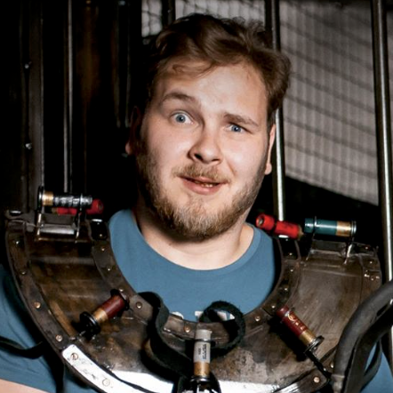
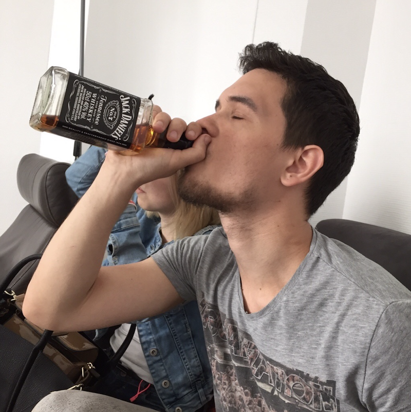
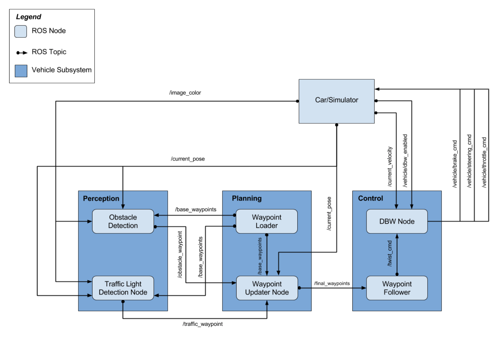
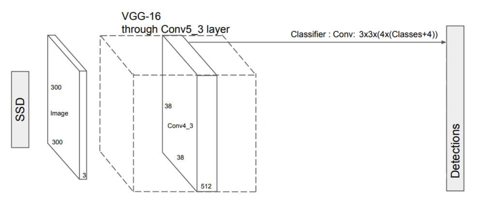

# Udacity Capstone Project
## System Integration Project

## Team: Eyjafjallajökull (Island Volcano)

This our final project implementation of the Udacity Self-Driving Car Nanodegree: Programming a Real Self-Driving Car.

|     Image              |     Name      |  LinkedIn    |     Email   |
|------------------------|---------------|----------------|---------------|
|  | Iurii Miedviediev (Team Lead) | [Linkedin](https://www.linkedin.com/in/druidkuma) | <druidkuma@gmail.com> |
|  | Ivan Korniyenko | [Linkedin](https://www.linkedin.com/in/ivan-korniyenko-27741b66) | <vankor1991@gmail.com> |

### Project Description
Solution contains thress individual nodes (Drive By Wire, Waypoint Updater, Traffic Light Detector). For each node an independent ROS was implemented. Nodes are communicating with each other using pub-sub.

Overall system architecture design can be seen from the next  diagram:
 
 
#### DBW Node
Steering is controller by yaw controller. Throttle and brake are controlled using PID controller. Tuned params which we used in final version:

| Parameter | Value  |
|-----------|--------|
| P | 0.7    |
| I | 0.00015 |
| D | 0.009   |

#### Waypoint Updater Node
This node receives updates from traffic light detector to know which light is on now, and publishes next waypoints for the vehicle.
Our system basically has two states, one for moving, and one for stopping. When there is no traffic lights nearby, or if the light is green, car is moving normally (accelerating).

If car if close to a traffic light, and light is red, car begin to stop. It does it via planning waypoints to the traffic light with deceleration on each waypoint so that last waypoint before the traffic light is zero (full stop).


#### Traffic Light Detection Node
We decided to use Deep Learning for detecting traffic lights in images from camera.
We have used SSD (Single Shot MultiBox Detector) model. It was designed for object detection in real-time.
The SSD object detection involves extracting feature maps and then applying convolution filters to detect objects:



### Installation

Please use **one** of the two installation options, either native **or** docker installation.

### Native Installation

* Be sure that your workstation is running Ubuntu 16.04 Xenial Xerus or Ubuntu 14.04 Trusty Tahir. [Ubuntu downloads can be found here](https://www.ubuntu.com/download/desktop).
* If using a Virtual Machine to install Ubuntu, use the following configuration as minimum:
  * 2 CPU
  * 2 GB system memory
  * 25 GB of free hard drive space

  The Udacity provided virtual machine has ROS and Dataspeed DBW already installed, so you can skip the next two steps if you are using this.

* Follow these instructions to install ROS
  * [ROS Kinetic](http://wiki.ros.org/kinetic/Installation/Ubuntu) if you have Ubuntu 16.04.
  * [ROS Indigo](http://wiki.ros.org/indigo/Installation/Ubuntu) if you have Ubuntu 14.04.
* [Dataspeed DBW](https://bitbucket.org/DataspeedInc/dbw_mkz_ros)
  * Use this option to install the SDK on a workstation that already has ROS installed: [One Line SDK Install (binary)](https://bitbucket.org/DataspeedInc/dbw_mkz_ros/src/81e63fcc335d7b64139d7482017d6a97b405e250/ROS_SETUP.md?fileviewer=file-view-default)
* Download the [Udacity Simulator](https://github.com/udacity/CarND-Capstone/releases).

### Docker Installation
[Install Docker](https://docs.docker.com/engine/installation/)

Build the docker container
```bash
docker build . -t capstone
```

Run the docker file
```bash
docker run -p 4567:4567 -v $PWD:/capstone -v /tmp/log:/root/.ros/ --rm -it capstone
```

### Usage

1. Clone the project repository
```bash
git clone https://github.com/udacity/CarND-Capstone.git
```

2. Install python dependencies
```bash
cd CarND-Capstone
pip install -r requirements.txt
```
3. Make and run styx
```bash
cd ros
catkin_make
source devel/setup.sh
roslaunch launch/styx.launch
```
4. Run the simulator
